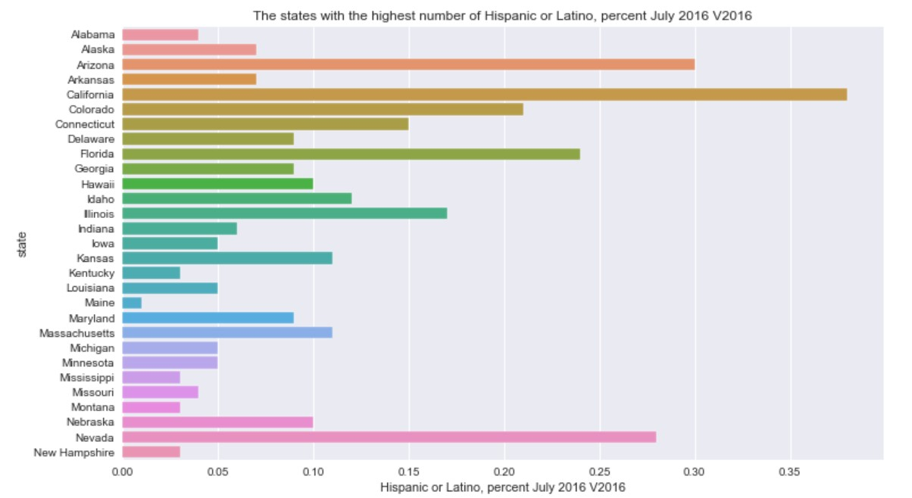
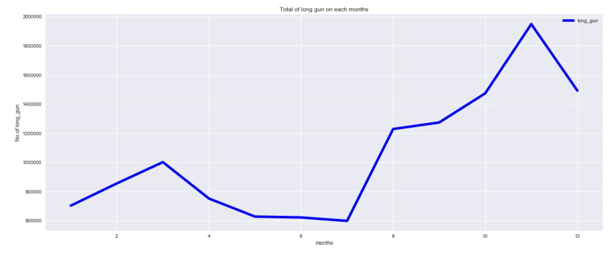
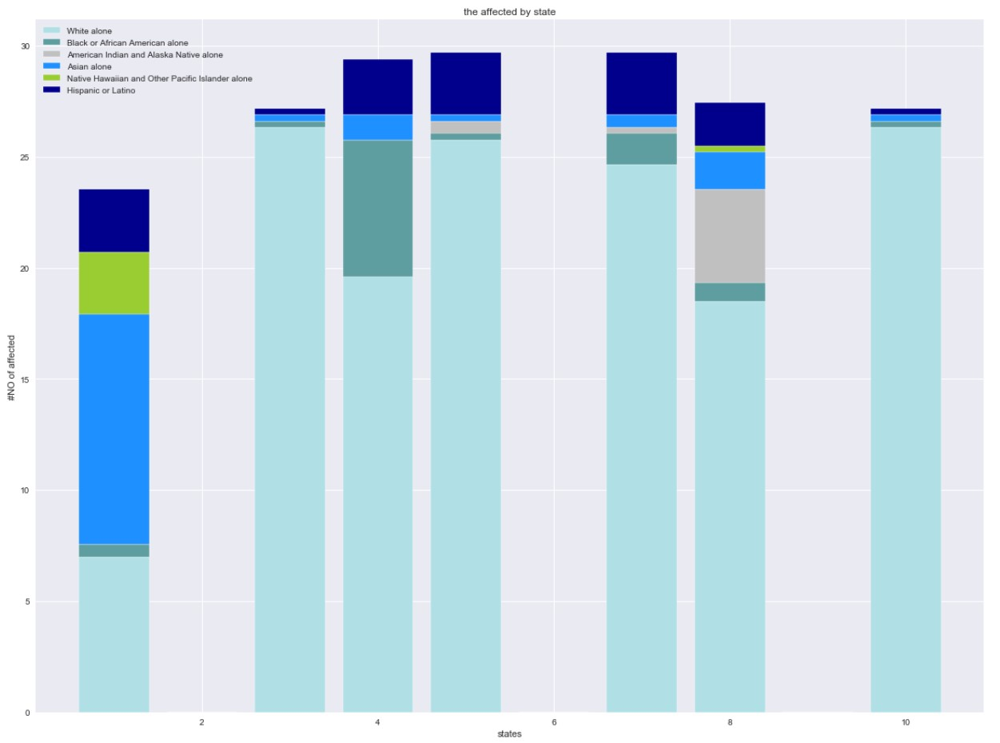

# FBI-gun-project-DAND
# Data-Analyst-Nanodegree-Udacity-project

Licensing, Authors, and Acknowledgements
<li><a href="#Installation">Installation</a></li>
<li><a href="#Project Motivation">Project Motivation</a></li>
<li><a href="#File Descriptions">File Descriptions</a></li>
<li><a href="#Results">Results</a></li>
<li><a href="#Licensing, Authors, and Acknowledgements">Licensing, Authors, and Acknowledgements</a></li>

# Installation:
Python versions 3.*.
 * pandas
 * NumPy
 * Matplotlib
 * csv

# Project Motivation:
This project used[FBI Gun Data](https://www.google.com/url?q=https://d17h27t6h515a5.cloudfront.net/topher/2017/November/5a0a554c_u.s.-census-data/u.s.-census-data.csv&sa=D&ust=1532469042128000) I was interested in working for a dataset I used before. This dataset comes from the FBI's National Instant Criminal Background
Check System. The NICS is used to
determine whether a prospective
buyer is eligible to buy firearms or
explosives. Gun shops call into this
system to ensure that each customer
does not have a criminal record or
isn’t otherwise ineligible to make a
purchase. The data has been
supplemented with state-level data
from. I  analyzed this dataset to find interesting outcomes and find interesting results. I asked and answered for these:

- What is the states with the highest number of Hispanic or Latino, percent July 2016 V2016?
-  How many handguns are available against the number of states?
-  What is the month which occurred the largest number of long gun purchases?
- Which state is encompass least affected by total of purchase of gun?
- What is highest gun purchase for each prospective buyer?

# File Descriptions:
To complete this project, you will use Jupyter Notebooks through a workspace in the classroom. Jupyter Notebooks are a great way to work with your code interactively while also being able to include descriptive and informative text to build a report. The next few concepts in this lesson will help you get started with understanding notebooks. If you would like to learn more about these tools, or you need some additional help to get started, you can check out Anaconda and Jupyter Notebooks in the "[Intro to Data Analysis](https://classroom.udacity.com/nanodegrees/nd025-mena-connect/parts/24b9c8f5-ef0f-4250-84d9-c5e8f843ed33)" Core Concept of this course.

# Results:
The outcomes after analyzing:

# Licensing, Authors, and Acknowledgements:
[The data in this repository comes from the FBI's National Instant Criminal Background Check System](https://www.fbi.gov/services/cjis/nics).
[github](https://github.com/BuzzFeedNews/nics-firearm-background-checks/blob/master/README.md)

